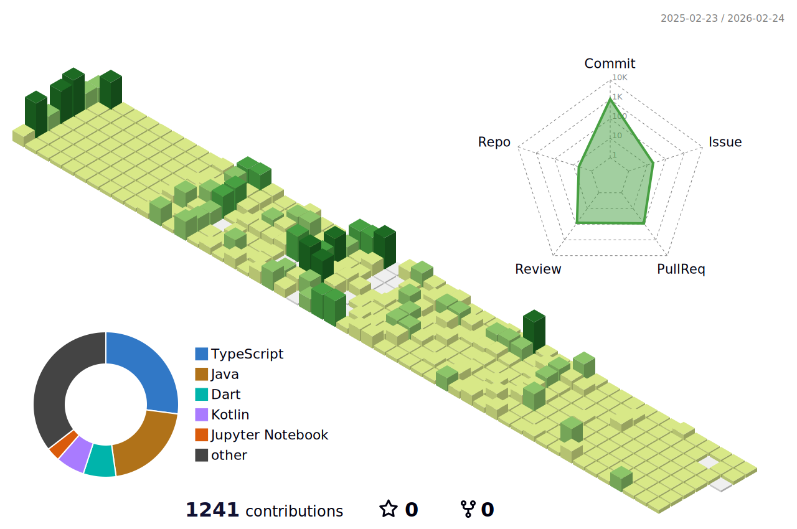

	
## 📚 Stacks  
  
 

## 🏆 Awards

  
Open this Toogle :)

| Award 	| Date                         	     | Contest                  | Repository			|
|-------------|---------------------------------   |-----------------------	|-----------------------	|
| 🥉 **동상(3위)** | 2024.11.14 | 2024 성공회대 제15회 IT 경진대회 | [내 손 안의 작은 친구, Mood Friend 🐾](https://github.com/LikeLion-12th-SKHU/LikeLion-12th-TEAM02-FE) |

## 🤝 Projects

  
Open this Toogle :)

| Name 	| Duration                         	     | Description                  | Repository			|
|-------------|---------------------------------   |-----------------------	|-----------------------	|
| **오늘의 한문장** | 2025.01.21 ~ 2025.02.23 | 책 명언 기록 및 공유 앱 서비스 | [책 명언을 기록하며 소통하는 감성 플랫폼 💌](https://github.com/today-sentence/today-sentence-front) |
| **ProLink** | 2024.11.11 ~ 2024.11.23 | 프로젝트와 팀원 관리 웹 서비스 | [효율적인 업무 분담을 지원하는 올인원 플랫폼 🔗](https://github.com/2024GanzithonPYTHON/14_Ganzi_Frontend) |
| **MOYEO** | 2024.10.26 ~ 2024.11.03 | AI 웹 게임 서비스 | [누구나 함께 즐길 수 있는 게임 🎮](https://github.com/moyeothon/2024_MOYEOYHON_12team_FE) |

## 📈 Stats
  

