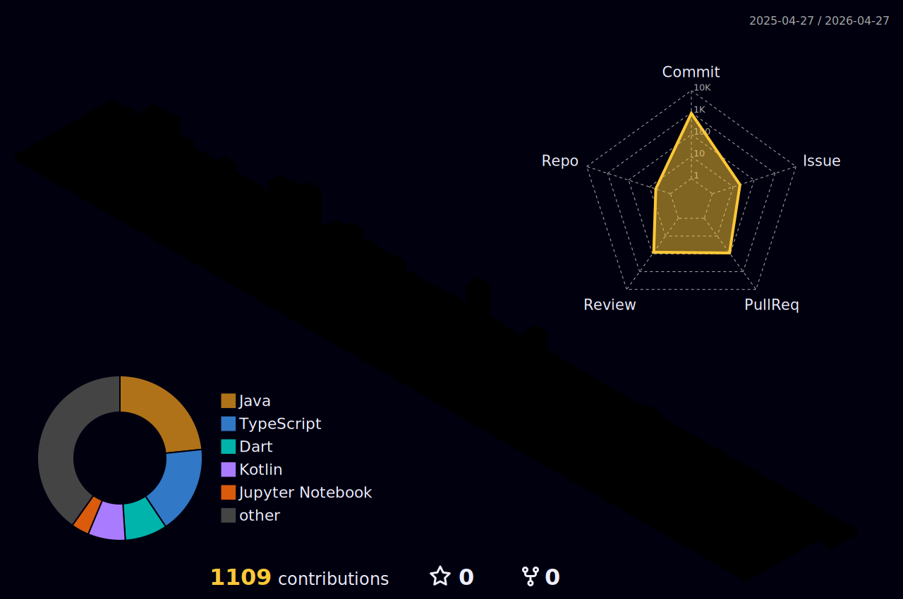

	
## 📚 Stacks  

<h3>Main</h3>

<!-- 디자인 & 언어 & 프론트엔드 프레임워크 -->

  

<h3>Learning</h3>

<!-- 백엔드 언어 & 프레임워크 -->

  

## 🏆 Awards

  
Click Here !

| Award 	| Date                         	     | Contest                  | Repository			|
|-------------|---------------------------------   |-----------------------	|-----------------------	|
| 🥈 **최우수상(2위)** | 2025.11.26 | 공공SI SW개발 AI 전문가 양성과정 최종 프로젝트 |[Oracle, Java, React 기반 모니터링 👀](https://github.com/SYS-2nit/CCDB-Frontend) |
| 🥉 **동상(3위)** | 2024.11.14 | 2024 교내 제15회 IT 경진대회 | [내 손 안의 작은 친구, Mood Friend 🐾](https://github.com/LikeLion-12th-SKHU/LikeLion-12th-TEAM02-FE) |

## 🤝 Projects

  
Click Here !

| Name 	| Duration                         	     | Description                  | Repository			|
|-------------|---------------------------------   |-----------------------	|-----------------------	|
| **CCDB** | 2025.09.29 ~ 2025.11.26 | [웹] 장애 예방과 AI 분석을 한 번에! | [Oracle, Java, React 기반 모니터링 👀](https://github.com/SYS-2nit/CCDB-Frontend) |
| **OnePlane** | 2025.08.28 ~ 2025.09.16 | [웹] 안전한 출국을 위한 여행 포털 | [Java, Jsp 기반 여행 위험도 관리/시각화 및 AI 국가 추천 ✈️ ](https://github.com/one-mix/one-plane) |
| **내일뭐입지** | 2025.07.14 ~ 2025.07.25 | [데스크탑 애플리케이션] 옷장 관리 및 AI 코디 추천 | [Java, JavaFx 기반 디지털 옷장 및 코디 관리 👕 ](https://github.com/sam-yuk-gu/what2wear) |
| **HelloWorld** | 2025.04.29 ~ 2025.10.28 | [엡] 외국인 노동자를 위한 지원센터 | [Kotlin 기반 외국인 노동자의 AI Contact Center 🤖](https://github.com/HelloWorld-AICC/HelloWorld-Android) |
| **오늘의 한문장** | 2025.01.21 ~ 2025.04.26 | [앱] 책 명언 기록 및 공유 | [react-native 기반 책 명언을 기록하며 소통하는 감성 플랫폼 📙](https://github.com/SuKyeong2002/today-sentence-front) |
| **Mood Friend** | 2024.05.09 ~ 2024.09.27 | [웹앱] AI 감정 챗봇 | [js, css 기반 내 손 안의 작은 친구 🐾](https://github.com/LikeLion-12th-SKHU/LikeLion-12th-TEAM02-FE) |
| **ZombiLand3D** | 2024.03.04 ~ 2024.06.18 |  [웹] 3D 좀비 슈팅 게임 | [C# 기반 Unity 엔진 게임 🧟](https://github.com/SuKyeong2002/ZombiLand3D) |

## 📈 Stats

  
Click Here !

| Name 	| Duration                         	     | Description                  | Repository			|
|-------------|---------------------------------   |-----------------------	|-----------------------	|
| **My Study** | 2024.05.28 ~  | 시간 날 때 풀고 노션에 오답 정리 | [혼자서 하는 알고리즘 공부](https://github.com/SuKyeong2002/Algorithm) |
| **Group Study** | 2025.06.05 ~ 2025.09.25 | 매주 3문제씩 풀고 각자 풀이 설명  | [3명이서 함께하는 알고리즘 스터디](https://github.com/algo-study-java/algorithm-study) |

 

