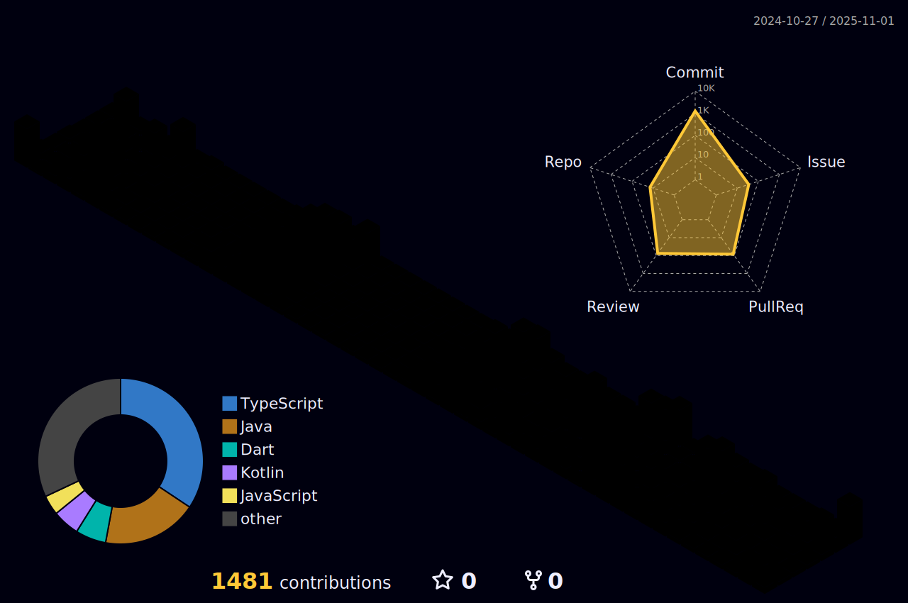

	
## 📚 Stacks  
  
 

## 🏆 Awards

  
Click Here !

| Award 	| Date                         	     | Contest                  | Repository			|
|-------------|---------------------------------   |-----------------------	|-----------------------	|
| 🥉 **동상(3위)** | 2024.11.14 | 2024 교내 제15회 IT 경진대회 | [내 손 안의 작은 친구, Mood Friend 🐾](https://github.com/LikeLion-12th-SKHU/LikeLion-12th-TEAM02-FE) |

## 🤝 Projects

  
Click Here !

| Name 	| Duration                         	     | Description                  | Repository			|
|-------------|---------------------------------   |-----------------------	|-----------------------	|
| **Synce** | 2025.05.27 ~ | [앱] 시술·수술 후 케어 서비스 | [의료진이 환자의 회복을 돕는 의료 플랫폼 🏥](https://github.com/MEDILUX-SYNCE/SYNCE-FE-APP) |
| **HelloWorld** | 2025.04.29 ~ | [엡] 외국인 노동자를 위한 지원센터 서비스 | [모든 외국인 노동자의 AI Contact Center 🤖](https://github.com/HelloWorld-AICC/HelloWorld-Android) |
| **오늘의 한문장** | 2025.01.21 ~ 2025.02.23 | [앱] 책 명언 기록 및 공유 앱 서비스 | [책 명언을 기록하며 소통하는 감성 플랫폼 📙](https://github.com/SuKyeong2002/today-sentence-front) |
| **Prolink** | 2024.11.11 ~ 2024.11.23 | [웹] 프로젝트와 팀원 관리 웹 서비스 | [효율적인 업무 분담을 지원하는 올인원 플랫폼 🔗](https://github.com/2024GanzithonPYTHON/14_Ganzi_Frontend) |
| **Moyeo** | 2024.10.26 ~ 2024.11.03 | [웹] AI 게임 서비스 | [누구나 함께 즐길 수 있는 게임 🎮](https://github.com/moyeothon/2024_MOYEOYHON_12team_FE) |
| **Mood Friend** | 2024.05.09 ~ 2024.09.27 | [웹앱] AI 감정 챗봇 | [내 손 안의 작은 친구, Mood Friend 🐾](https://github.com/LikeLion-12th-SKHU/LikeLion-12th-TEAM02-FE) |

## 📈 Stats

  
Click Here !

| Name 	| Duration                         	     | Description                  | Repository			|
|-------------|---------------------------------   |-----------------------	|-----------------------	|
| **My Study** | 2024.05.28 ~  | 시간 날 때 풀고 노션에 오답 정리 | [혼자서 하는 알고리즘 공부](https://github.com/SuKyeong2002/Algorithm) |
| **Group Study** | 2025.06.05 ~ | 매주 3문제씩 풀고 각자 풀이 설명  | [3명이서 함께하는 알고리즘 스터디](https://github.com/algo-study-java/algorithm-study) |

 

